# Mermaid Diagrams for Bug Localization System

All diagrams can be rendered in:
- GitHub (paste in .md files)
- Mermaid Live Editor: https://mermaid.live/
- Documentation tools (GitBook, MkDocs, etc.)

---

## 1. Complete Pipeline Flow


---

## 2. Detailed Ranking Algorithm


---

## 3. Scoring System Details

```mermaid
graph LR
    Bug[Bug Report: NPE at World.resolve] --> Strategies
    
    subgraph Strategies[" SEARCH STRATEGIES "]
        S1[Stack Trace Search<br/>🔴 Score: 10]
        S2[LLM Analysis<br/>🟡 Score: 5]
        S3[Keyword Match<br/>🟢 Score: 3]
    end
    
    S1 --> |Found: World| L1[org.aspectj.weaver.World]
    S2 --> |Found: World| L1
    S3 --> |Found: World| L1
    
    S1 --> |Found: BcelWorld| L2[org.aspectj.weaver.bcel.BcelWorld]
    S3 --> |Found: BcelWorld| L2
    
    S3 --> |Found: resolve| L3[World.resolve method]
    
    L1 --> Score1[Total: 10 + 5 + 3 = 18 pts<br/>🥇 RANK #1]
    L2 --> Score2[Total: 10 + 3 = 13 pts<br/>🥈 RANK #2]
    L3 --> Score3[Total: 3 pts<br/>🥉 RANK #3]
    
    Score1 --> Result
    Score2 --> Result
    Score3 --> Result
    
    Result[Top-5 Results]
    
    style Bug fill:#FFEBEE,stroke:#C62828
    style S1 fill:#FFCDD2,stroke:#C62828
    style S2 fill:#FFF9C4,stroke:#F57F17
    style S3 fill:#C8E6C9,stroke:#388E3C
    style Score1 fill:#FFD700,stroke:#FF8F00,color:#000
    style Score2 fill:#C0C0C0,stroke:#616161,color:#000
    style Score3 fill:#CD7F32,stroke:#5D4037,color:#fff
```



---

## 4. Knowledge Graph Schema


---

## 5. Automation Flow


---

## 6. Bug Report Processing Detail


---

## 7. System Architecture


---

## 8. Top-5 Ranking Visualization


---

## 9. Configuration Flow


---

## 10. Real-Time Execution Flow


---

## How to Use These Diagrams

### 1. **In GitHub/GitLab**
Simply paste the code blocks in your `.md` files. They will render automatically.

### 2. **Mermaid Live Editor**
1. Go to https://mermaid.live/
2. Paste any diagram code
3. Export as PNG/SVG for presentations

### 3. **PowerPoint/Presentations**
1. Use Mermaid Live Editor to export as PNG
2. Insert images in your slides

### 4. **Documentation Tools**
Most modern documentation tools (MkDocs, Docusaurus, GitBook) support Mermaid natively.

### 5. **VS Code**
Install "Markdown Preview Mermaid Support" extension to preview in VS Code.

---

## Customization Tips

### Change Colors
```mermaid
style NodeName fill:#HEX,stroke:#HEX,color:#HEX
```

### Change Flow Direction
- `TB` = Top to Bottom
- `LR` = Left to Right
- `BT` = Bottom to Top
- `RL` = Right to Left

### Add Icons
Use emoji in node text:

```mermaid
graph LR
    A[📊 Data] --> B[🔍 Analysis]
```


---

*Created for Bug Localization System v2.0*  
*All diagrams are MIT Licensed - use freely in presentations*

